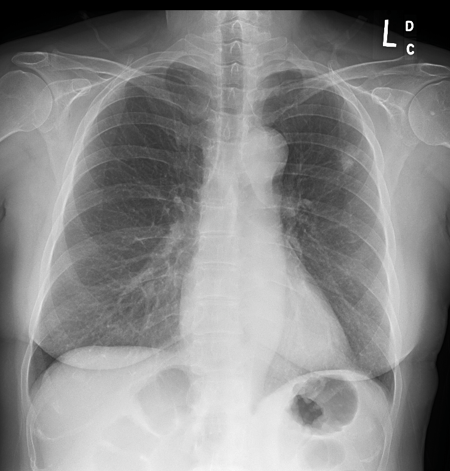
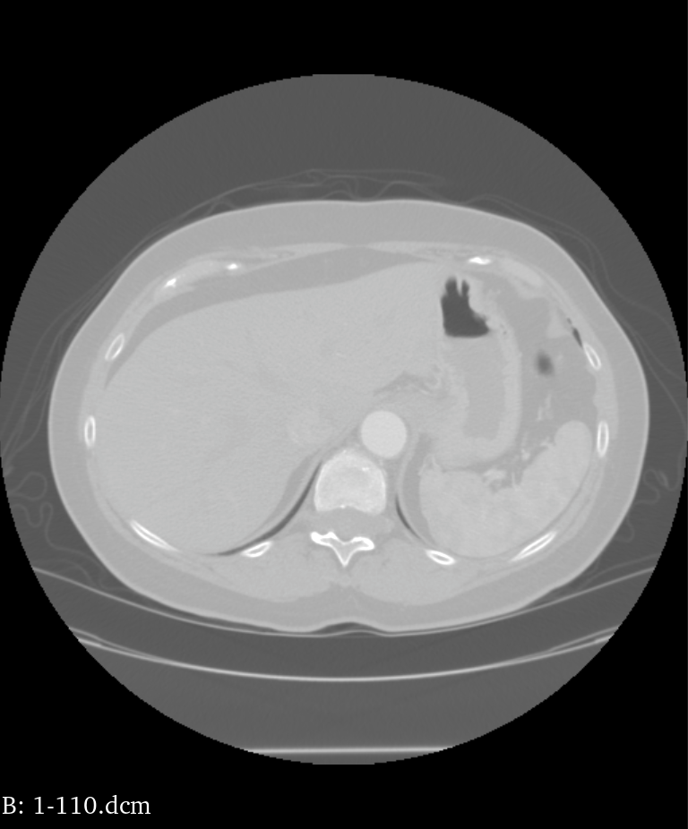

<h1 align="center">LIDC/IDRI documentation  🫁 </h1>

## Description
This repository is a brief documentation of TCIA's Lung Image Database Consortium image set (LIDC/IDRI) and its annotated files.

## Table of Content
- [Overview](#overview)
- [Radiologist Annotations(XML)](#radiologist_annotations(xml))
- [LIDC DICOM](#images)
- [LIDC Nodule size list](#meta)
- [Support](#support)
## Overview
Each patient has two folders
- Chest PA Lateral (DICOM + XML)
- Chest CT scan (DICOM + XML)
<p align="center">

  

  
</p>

#### Categories of objects
- Nodules > 3mm diameter but < 30 diameter<br>
  Each expert annotates an outline around the nodule. 
- Nodules < 3mm diameter<br>
  Each expert marks the center of mass.
- Non-Nodules >= 3mm diameter<br>
  Each expert marks the center of mass.
- Non-Nodules < 3mm diameter<br>
  No annotation


In our study, we only focus on Chest CT scan and we concentrate on the nodules > 3mm marked by at least one expert.

## Radiologist Annotations(XML)
### For nodule > 3mm diameter:
This block indicates an unblinded reading section by one expert.
```xml
<unblindedReadNodule>
   ...
</unblindedReadNodule>
```
<noduleID> is a unique id for this nodule marked by this expert, and <roi> block presents the 3D contour of the nodule

```xml
<unblindedReadNodule>
   <noduleID>Nodule xxx</noduleID>
    .....
    <roi>
       ....
    </roi>
</unblindedReadNodule>
```

 <mark>image Z position</mark> and <imageSOP_UID> present the z position and xCoord, yCoord describe the contour point in each x-y plane.
Coordinate (0,0) is on the upper left of the image. If inclusion is True, the contour belongs to the nodule, otherwise is subtracted from the nodule.
```xml
<roi>
  <imageZposition>-xxx</imageZposition>
    <imageSOP_UID> xxxx </imageSOP_UID> 
      <inclusion>TRUE</inclusion>
      <edgeMap>
          <xCoord>xxx</xCoord>
          <yCoord>xxx</yCoord>
        </edgeMap>
  ......
</roi>

```

### For each nodule < 3mm or non-nodule > 3mm:
Only a single point is marked
  
## LIDC DICOM
### DICOM header
The information in header is organised into groups. We are interested in the image plane, image pixel and in DICOM, which are
  - (0018,0050) Slice Thickness
  - (0020,0032) Image Position
  - (0020,1041) Slice Location
  - (0028,0030) Pixel Spacing
  - (0028,0002) Samples per Pixel
### Relationship between DICOM and XML
- <mark>image Z position</mark>  in xml is the table position record in the third element of the tuple in DICOM header (0020,0032), where the nodule can be visualized and contoured for this image slice
- <mark>imageSOP_UID</mark> is a unique identifier in the DICOM header (0008,0018) for this image slice. <br>

More information in DICOM.ipynb

  
## LIDC Nodule size list
This list provides nodule size estimations for LIDC/IDRI dataset, we are interested in:
  - X loc:  center-of-mass x coordinates of nodules
  - Y loc:  center-of-mass y coordinates of nodules
### Relationship between DICOM and Nodule size list
  - Scan in Nodule size list is the DICOM series number in (0020,0011)
 
  
## Support
[TCIA Public access](https://wiki.cancerimagingarchive.net/display/Public/LIDC-IDRI) <br>
[DICOM Standard Browser](https://dicom.innolitics.com/ciods/rt-dose/image-plane/00280030)<br>
[Nodule size list documentation](http://www.via.cornell.edu/lidc/)<br>
LIDC XML documentation 1 Jan 2009 <br>

🤝  Contributions, issues, and feature requests are welcome!
