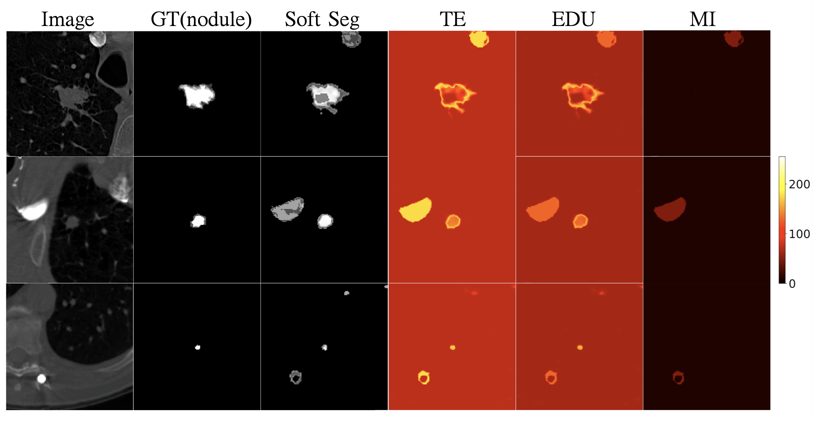

<h1 align="center">Disentangling Sources of Uncertainty <br> in Medical Image Analysis </h1>

## Description
This repository is a PyTorch implementation for the master thesis: <mark> Disentangling Sources of Uncertainty in Medical Image Analysis </mark>.

## Table of Content
- [Overview](#overview)
- [Setup](#setup)
- [Run](#run)
- [Support](#support)
## Overview

<p align="center">
  
</p>
The Dirichlet Prior Network can disentangling different sources of uncertainty on the lung CT image dataset with real out-of-distribution data.

## Setup
Please install the following requirements on your environment:
```
pip install -r requirements.txt
```
  
## Run 
The code can be run using the following commands:
```
sbatch -p gpu-2080ti DPN.sh
sbatch -p gpu-2080ti MCD.sh
sbatch -p gpu-2080ti SSN.sh
```
You can use the following commands to write the sbatch file
```
#!/bin/bash
#SBATCH --job-name=DPN
#SBATCH --ntasks=1                                              
#SBATCH --cpus-per-task=1                                    
#SBATCH --nodes=1                                               
#SBATCH --time=3-00:00                                     
#SBATCH --partition=gpu-2080ti                                 
#SBATCH --gres=gpu:2                                            
#SBATCH --mem=50G                                               
#SBATCH --output=xxx                  
#SBATCH --error=xxx              
#SBATCH --mail-type=END                                        
#SBATCH --mail-user=xxx

scontrol show job $SLURM_JOB_ID 
CUDA_LAUNCH_BLOCKING=1 python train_DPN.py
 
```
 
## Support
[Data from Stefan Knegt](https://github.com/stefanknegt/Probabilistic-Unet-Pytorch) <br>
🤝  Contributions, issues, and feature requests are welcome!
